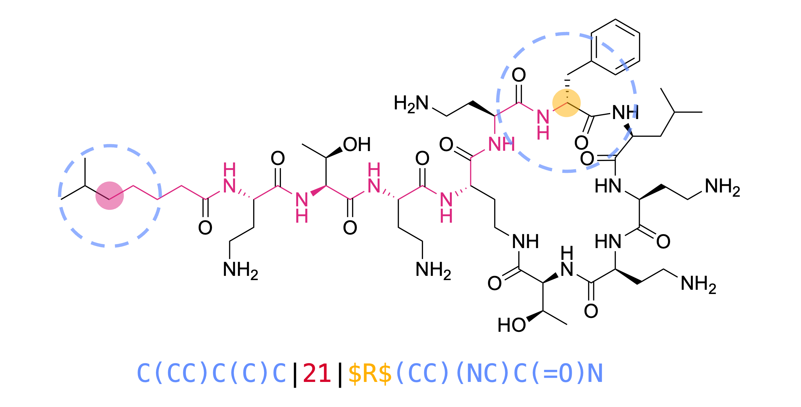

# **MAP*** (Chiral MinHashed Atom-Pair Fingerprint)

  

## Theory

The original version of the MinHashed Atom-Pair fingerprint of radius 2 (MAP4) successfully combined circular substructure fingerprints and atom-pair fingerprints into a unified framework. This combination allowed for improved substructure perception and performance in small molecule benchmarks while retaining information about bond distances for molecular size and shape perception.

The present code expands the functionality of MAP4 to include encoding of stereochemistry into the fingerprint. Hereby, the CIP descriptors of chiral atoms are encoded into the fingerprint at the highest radius. This design choice allows to modulate the impact of stereochemistry on overall similarity, making it scale with increasing molecular size without disproportionally affecting structural similarity. The resulting fingerprint, MAP*, is calculated as follows:

<p align="center">
    
    <br>
    <em>Fingerprint and shingle design. Every shingle contains two circular substructures (blue), the topological disance between the two substructures (red) and the CIP descriptor replacing the chiral atom (green). </em>
</p>


1. At every non-hydrogen atom, all circular substructures up to the specified maximum radius are extracted in SMILES format. Radius 0 is skipped.

2. At the specified maximum radius, whenever the central atom of a circular substructure is chiral, the atom symbol in the extracted SMILES is replaced with its CIP descriptor bracketed by two “\$” characters (\$CIP\$). The CIP descriptor of the chiral atom is defined on the entire molecule.

3. At each radius, shingles for all possible pairs of extracted substructures are generated. Each shingle contains two substructures and their topological distance in following format: **“substructure 1 | topological distance | substructure 2"**.

4. The list of shingles is minhashed to obtain a fixed sized vector. 

### Additional improvements 

Additional improvements to the original MAP4 code include: 

* **Parallelization**: The fingerprint calculation for a list of molecules is implemented in parallel using the multiprocessing library, which significantly reduces the calculation time for larger datasets. 

* **Feature mapping**: I included the option to map the hashes in the fingerprint to their respective shingles of origin. The idea is to enable the use of the fingerprint for explainable machine learning tasks. This function significantly increases the calculation time. It also gives different fingerprints than the non-mapped version as I had to change the minhashing function to make it work. Therefore, please be mindful when using this option and only use it when mapping is required. Also, if anyone has a better idea on how to implement this function, please let me know!


#### If you find any bugs, have suggestions for improvement or want to contribute to the code, please open a new issue and I will get back to you as soon as possible.

## Getting started

### Prerequisites

You will need following prerequisites: 

* [Python](https://www.python.org)
* [RDKit](https://www.rdkit.org)
* [NumPy](https://numpy.org)

## Installing MAP*

#### **Installing via GitHub**

To obtain a local copy of the project clone the GitHub repository as follows:

```console
git clone https://github.com/reymond-group/mapchiral.git
```

Create a new conda environment by running following command:

```console
conda env create -f mapchiral.yml
```

Activate the environment:

```console
conda activate mapchiral
```

And finally you are ready to run the code from the cloned repository. 

#### **Installing via pip**

Alternatively, you can pip-install mapchiral on an existing Conda environment as follows:

```console
conda activate my_environment
```

```console
pip install mapchiral
```

## Using MAP*

MAP* can be used for the quantitative comparison of molecules. The similarity between two molecules can calculated as the Jaccard similarity between their fingerprints using the function provided in the mapchiral package: 

```python
from rdkit import Chem
from mapchiral.mapchiral import encode, jaccard_similarity

molecule_1 = Chem.MolFromSmiles('C1CC(=O)NC(=O)[C@@H]1N2C(=O)C3=CC=CC=C3C2=O')
molecule_2 = Chem.MolFromSmiles('C1CC(=O)NC(=O)[C@H]1N2C(=O)C3=CC=CC=C3C2=O')

fingerprint_1 = encode(molecule_1, max_radius=2, n_permutations=2048, mapping=False)
fingerprint_2 = encode(molecule_2, max_radius=2, n_permutations=2048, mapping=False)

similarity = jaccard_similarity(fingerprint_1, fingerprint_2)

print(similarity)

```

The mapchiral package also contains a function to calculate the fingerprints of a list of molecules simultaneously. This is especially useful for larger datasets as the calculation is parallelized and therefore much faster.

```python
from rdkit import Chem
from mapchiral.mapchiral import encode_many

molecule1 = Chem.MolFromSmiles('C1CC(=O)NC(=O)[C@@H]1N2C(=O)C3=CC=CC=C3C2=O')
molecule2 = Chem.MolFromSmiles('C1CC(=O)NC(=O)[C@H]1N2C(=O)C3=CC=CC=C3C2=O')
molecules = [molecule1, molecule2]

fingerprints = encode_many(molecules, max_radius=2, n_permutations=2048, mapping=False, n_cpus=4)

print(fingerprints)
```

Finally, the mapchiral package has an option (experimental) to map the hashes in the fingerprints to their original shingles. This is useful for explainable machine learning tasks. However, it significantly increases the calculation time. Mapping is also available for the "encode_many" function, where it returns a single dictionary containing all hashes present in the fingerprints and their respective shingles of origin. 

```python
from rdkit import Chem
from mapchiral.mapchiral import encode, jaccard_similarity

molecule_1 = Chem.MolFromSmiles('C1CC(=O)NC(=O)[C@@H]1N2C(=O)C3=CC=CC=C3C2=O')

fingerprint, hash_map = encode(molecule_1, max_radius=2, n_permutations=2048, mapping=True)

print(fingerprint)
print(hash_map)
```

## License
[MIT](https://choosealicense.com/licenses/mit/)

## Contact

 
